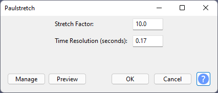

# Speeding up and slowing down audio

## Changing the speed while preserving pitch


**Caution:** Changing speed without affecting the pitch always leads to artefacts. Avoid repeatedly applying these effects.


To change the speed while preserving the pitch, select the audio you want to apply the effect on and go to **Effect > Change Tempo**

Drag the slider or enter some numbers to change how much you want to speed up or slow down your audio. The controls are linked, so you just need to change the value you care about, the rest will update accordingly.&#x20;

For extreme slowdowns (10x slower to thousands of times slower), you may want to use **Effect > Paulstretch** instead.&#x20;


**Note:** Paulstretch is only capable of slowing down, so the stretch factor relates to how many times you want to slow down your audio.&#x20;

The time resolution decides on whether the algorithm will focus on frequencies and pitch at the expense of rhythm (high time resolution), or whether it will focus on rhythm at the expense of pitch (low time resolution). Generally. 0.25 is a good compromise for most music


## Changing speed and pitch at the same time

To change speed and pitch at the same time, use **Effect > Change Speed**.

Unlike [Change Tempo](speeding-up-and-slowing-down-audio.md#changing-the-speed-while-preserving-pitch), the Change Speed effect keeps the waveform mostly intact, so you can use this method repeatedly without any major loss in quality.&#x20;

## Dynamically changing the speed over time

You can change the speed of an entire project over time using Time Tracks. To add one, go to **Tracks > Add New > Time Track**. You only can have one time track per project.

Then click on the blue line and drag it upwards or downwards to change the speed at that time. Every time you click, a new control point is added, allowing you to change the speed over time


**Tip:** By default, the range goes from 90% to 110% speed. If you want to extend that, **right-click** the vertical scale (going from 90-110) and select **Range...** to set a new range. The new range may be between 10% and 1000%.&#x20;


## Changing playback speed

If you want to preview your audio at a faster or slower rate than normal, but without affecting the final product, you can use the **Play-at-Speed toolbar** ****

To use it, drag the slider to the desired speed (between 0.01x and 3x) and then click the small play button next to it to playback your audio at that speed. You can use the normal stop and pause controls to stop/pause playback.&#x20;
