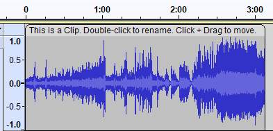

# Editing Audio

## Importing a file

To start editing, you need some sort of sound to edit. You can either [record some sound](recording-your-voice-and-microphone/), or import an existing sound file (for example, an MP3 or WAV) by dragging & dropping it into the project window. You can also import files via the **File > Import** menus.&#x20;


**Note:** To import proprietary file formats such as M4A or WMA, you need to [install FFMPEG](downloading-and-installing-audacity/installing-ffmpeg.md) first.&#x20;


Once you have that, you will see a waveform of your sound:&#x20;

 (1).png>)

This waveform is a visual representation of the song. The larger the blue "blob" is, the louder the section. Lines standing alone ("spikes") indicate sudden and short loud sections such as clicks, snaps, claps and drum hits. With a bit of practice, you can use the waveform to quickly find your way around an audio file.&#x20;

## Removing sections of a song

To remove a section of an audio file, first select the section by **clicking and dragging** in the waveform.


**Hint**: You can zoom in using the .png>)Zoom+ icon, or by `Ctrl+Scroll` (`Cmd+Scroll`) to precisely adjust the beginning and end of the selection.


Once you have a selection, press `Delete` or `Backspace` to delete it.&#x20;

## Moving sections of audio (clips)

Audacity supports clips, which are pieces of audio inside the project which can be moved independently. Technically, any audio you record or import already exists as a clip, denoted by the rounded clip handle bars above the waveform.&#x20;

You can **click + drag** on the clip handle bar to move a clip around.&#x20;

## Splitting up clips

To split a clip into two independent clips,&#x20;

1.  Click into the waveform where you want to split the clip.&#x20;

    **Tip:** To make precise adjustments, zoom in first.
2. **Right-click > Split Clip** (`Ctrl+I` / `Cmd+I`)


**Note:** If you select some audio instead, it will create a clip out of the selection.&#x20;


## Resizing and trimming clips

To trim a clip, hover with your cursor around the **upper third** of the left or right edge of a clip:

Then **click and drag** the edge to trim the clip to it's desired length.&#x20;


**Note:** Trimming is a non-destructive operation. You can un-trim a clip at any time. If you have created your clip by [splitting up](audacity-editing.md#splitting-up-clips) a larger clip, you can even un-trim the current clip until it's at the length of the old clip. &#x20;


## Applying Effects

Audacity supports a wide range of effects and effect plugins. These effects can be used for [noise-reduction-removal.md](../repairing-audio/noise-reduction-removal.md "mention") and more, and while each effect does different things, they all generally can be applied in the following way:&#x20;

1.  Select the audio you want to apply the effect to.&#x20;

    **Tip:** If you want to apply an effect onto your entire project, select it with `Ctrl + A` (`Cmd + A`).
2. Go to the **Effect menu.**
3.  Select the effect you want to use. Typically, a window like this will open:&#x20;

    
4. Tweak the effect to your liking. You can click the **Preview** button to hear a short sample before applying it to the whole selection.&#x20;
5. Press OK to apply the effect.
